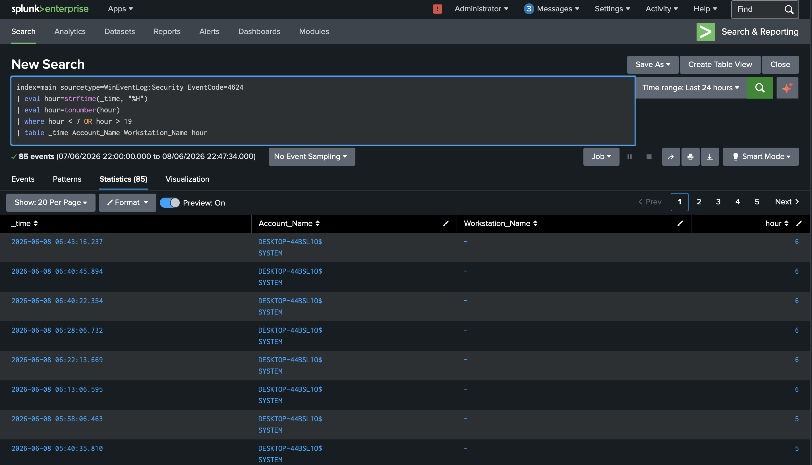
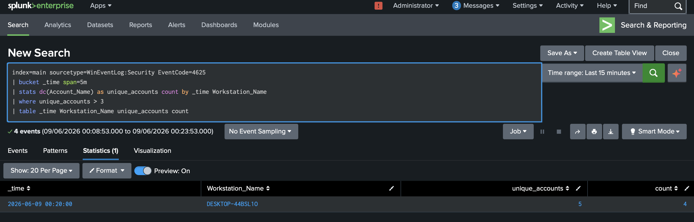

# Lab 2 - SPL Detection Queries for Common Attack Patterns
## Objective
Build on Lab 1 by writing additional SPL detection rules for 
after-hours login anomalies and password spraying attacks.
## Environment
- Windows 11 VM (DESKTOP-44BSL10) — target machine
- Kali Linux — attacker machine
- Splunk Enterprise — SIEM
- All Windows Security logs forwarded via Splunk Universal Forwarder
## Detection 2 - After-Hours Login Detection

### What is an after-hours login?
Attackers often access compromised accounts outside business hours 
to avoid detection. Flagging logins before 7am or after 7pm can 
surface suspicious activity that would otherwise blend in.

### Detection Query
index=main sourcetype=WinEventLog:Security EventCode=4624
| eval hour=strftime(_time, "%H")
| eval hour=tonumber(hour)
| where hour < 7 OR hour > 19
| table _time Account_Name Workstation_Name hour

### Query Explanation
- EventCode=4624 filters for successful logon events
- strftime extracts the hour from the timestamp
- tonumber converts it to a number for comparison
- where hour < 7 OR hour > 19 flags anything outside 7am-7pm

### Results
85 events detected outside business hours, mostly SYSTEM account 
activity between 5am-6am. In a real environment these would be 
investigated to confirm they are expected automated processes.

### MITRE ATT&CK
T1078 - Valid Accounts

## Detection 3 - Password Spray Detection

### What is a password spray attack?
Unlike brute force which targets one account with many passwords,
password spraying tries one password against many accounts.
This avoids account lockouts while still attempting to gain access.

### How i simulated it
I attempted authentication against 4 different accounts with 
wrong passwords from the same machine:

net use \\127.0.0.1\IPC$ /user:Administrator wrongpass
net use \\127.0.0.1\IPC$ /user:Guest wrongpass
net use \\127.0.0.1\IPC$ /user:Admin wrongpass
net use \\127.0.0.1\IPC$ /user:Olufemi wrongpass

### Detection Query
index=main sourcetype=WinEventLog:Security EventCode=4625
| bucket _time span=5m
| stats dc(Account_Name) as unique_accounts count by _time Workstation_Name
| where unique_accounts > 3
| table _time Workstation_Name unique_accounts count

### Query Explanation
- dc(Account_Name) counts distinct usernames targeted
- unique_accounts > 3 triggers when more than 3 different 
  accounts are targeted from the same machine in 5 minutes
- This distinguishes spray attacks from single-account brute force

### Results
Detected 5 unique accounts targeted from DESKTOP-44BSL10 
within a single 5 minute window, consistent with password spraying.

### MITRE ATT&CK
T1110.003 - Brute Force: Password Spraying
