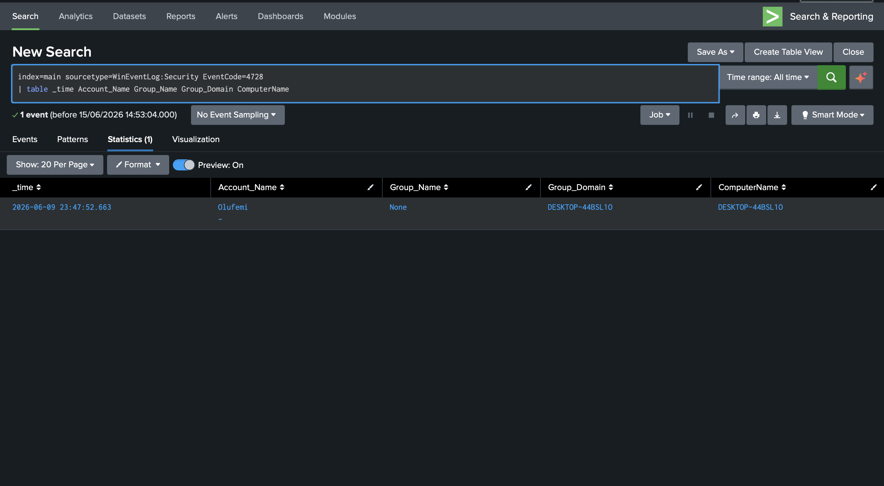
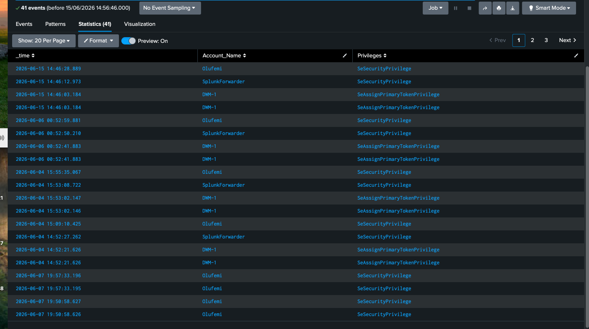

# Lab 3 - Privilege Escalation Detection

## Objective
Simulate a privilege escalation attack and detect it using 
Splunk by monitoring Windows Security Event IDs 4728 and 4672.

## Environment
- Windows 11 VM (DESKTOP-44BSL10) — target machine
- Splunk Enterprise — SIEM
- Windows Security Event Logs forwarded via Splunk Universal Forwarder

---

## What is Privilege Escalation?
Privilege escalation is a technique used by attackers after 
gaining initial access to a system. The attacker attempts to 
gain higher level permissions — typically Administrator — to 
take full control of the machine.

This maps to MITRE ATT&CK: T1078 - Valid Accounts and 
T1098 - Account Manipulation.

---

## Attack Simulation

### Step 1 - Created a low privilege test user
I created a standard user account with no admin rights:

net user testuser Password123 /add

### Step 2 - Escalated privileges
I added testuser to the Administrators group, simulating 
what an attacker would do after gaining initial access:

net localgroup Administrators testuser /add

---

## Detection 1 - Group Membership Change (Event ID 4728)

### What does Event ID 4728 mean?
Event ID 4728 fires whenever a user is added to a 
security-enabled global group such as Administrators.
This is a high priority alert in any SOC environment.

### Detection Query
index=main sourcetype=WinEventLog:Security EventCode=4728
| table _time Account_Name Group_Name Group_Domain ComputerName

### Results
Detected Olufemi adding a user to the Administrators group 
on DESKTOP-44BSL10 at 2026-06-09 23:47:52.

---

## Detection 2 - Special Privileges Assigned (Event ID 4672)

### What does Event ID 4672 mean?
Event ID 4672 fires when an account logs on with sensitive 
privileges such as SeSecurityPrivilege. Seeing a regular 
user account appear here , rather than just SYSTEM, is 
a strong indicator of privilege escalation.

### Detection Query
index=main sourcetype=WinEventLog:Security EventCode=4672
| where Account_Name!="SYSTEM" AND Account_Name!="LOCAL SERVICE" 
  AND Account_Name!="NETWORK SERVICE"
| table _time Account_Name Privileges

### Results
Detected Olufemi logging on with SeSecurityPrivilege, 
confirming the account now has elevated admin rights 
following the group membership change.

---

## Attack Chain Summary
1. Attacker adds account to Administrators group → Event ID 4728
2. Attacker logs in with new admin privileges → Event ID 4672
3. Both events captured and alerted in Splunk

## MITRE ATT&CK
- T1078 - Valid Accounts
- T1098 - Account Manipulation
